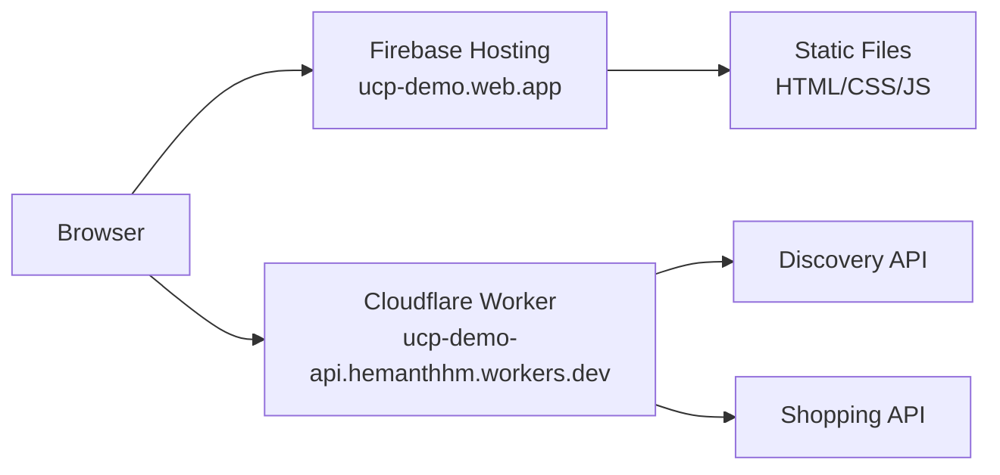

# UCP Demo

An interactive demo showcasing the [Universal Commerce Protocol (UCP)](https://ucp.dev) – an open standard for AI agents and platforms to complete purchases on any UCP-enabled merchant.

https://github.com/user-attachments/assets/0c4879a7-2dc5-4693-bffe-d34562cde3a7


🔗 **Live Demo:** [https://ucp-demo.web.app](https://ucp-demo.web.app)

## What is UCP?

UCP is an open standard enabling seamless commerce interoperability between platforms, AI agents, and businesses. Like OpenID for identity, UCP provides a standardized way for any platform to discover merchant capabilities and complete purchases.

## Features Demonstrated

| Feature | Status | Description |
|---------|--------|-------------|
| Discovery | ✅ Implemented | `/.well-known/ucp` endpoint with capabilities and payment handlers |
| Checkout Sessions | ✅ Implemented | Full flow: create → update → complete |
| Debug Mode | ✅ Implemented | Toggle to see actual API calls in real-time |
| Payment | ⚡ Mocked | Test tokens only, no real charges |
| Storage | ⚡ Mocked | In-memory, resets each session |

## Architecture



**How it works:**
1. **Frontend** served from Firebase Hosting (static HTML/CSS/JS)
2. **API calls** go to Cloudflare Worker (serverless, in-memory)
3. **Discovery** at `/.well-known/ucp` returns merchant capabilities
4. **Checkout flow** uses REST API for create → update → complete

## Local Development

```bash
# Install dependencies
npm install

# Run dev server
npm run dev

# Open http://localhost:3000
```

## API Endpoints

| Endpoint | Method | Description |
|----------|--------|-------------|
| `/.well-known/ucp` | GET | UCP Discovery profile |
| `/api/shopping/products` | GET | List products |
| `/api/shopping/checkout-sessions` | POST | Create checkout |
| `/api/shopping/checkout-sessions/:id` | GET/PUT | Get/Update checkout |
| `/api/shopping/checkout-sessions/:id/complete` | POST | Complete purchase |

## Learn More

- [UCP Specification](https://ucp.dev)
- [UCP GitHub](https://github.com/Universal-Commerce-Protocol/ucp)

---

Built with ❤️ by [Hemanth HM](https://h3manth.com)
