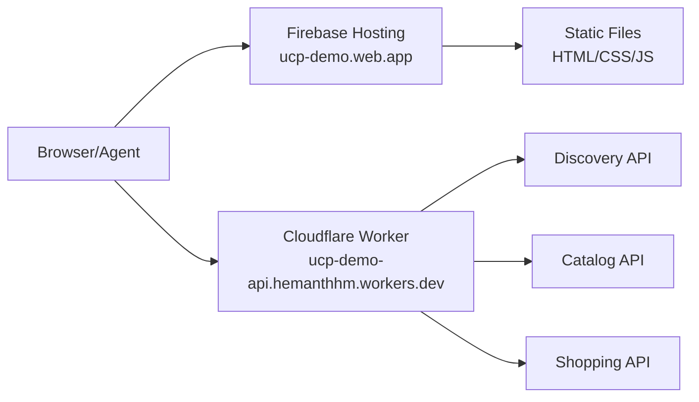
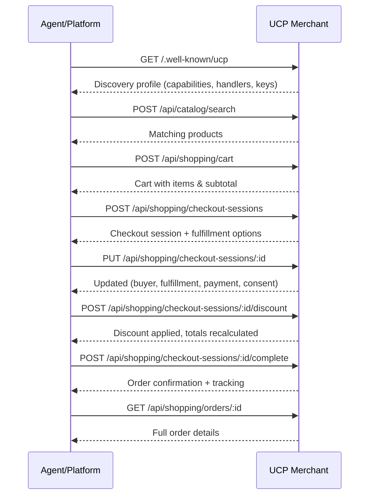

# UCP Demo

An interactive demo showcasing the [Universal Commerce Protocol (UCP)](https://ucp.dev) – an open standard for AI agents and platforms to complete purchases on any UCP-enabled merchant.

https://github.com/user-attachments/assets/0c4879a7-2dc5-4693-bffe-d34562cde3a7


🔗 **Live Demo:** [https://ucp-demo.web.app](https://ucp-demo.web.app)

## What is UCP?

UCP is an open standard enabling seamless commerce interoperability between platforms, AI agents, and businesses. Like OpenID for identity, UCP provides a standardized way for any platform to discover merchant capabilities and complete purchases.

## Features Demonstrated

| Feature | Status | Description |
|---------|--------|-------------|
| Discovery | ✅ Implemented | `/.well-known/ucp` with capabilities, payment handlers, signing keys |
| Catalog | ✅ Implemented | Search and lookup products via UCP catalog capability |
| Cart | ✅ Implemented | Create, read, update, delete shopping carts |
| Checkout Sessions | ✅ Implemented | Full flow: create → update → complete → cancel |
| Fulfillment | ✅ Implemented | Shipping options, express/standard/pickup/overnight |
| Discounts | ✅ Implemented | Promo codes: `SAVE10`, `FREESHIP`, `FLAT20` |
| Buyer Consent | ✅ Implemented | Terms, privacy, marketing opt-in |
| Orders | ✅ Implemented | Get/list orders with tracking numbers |
| Debug Mode | ✅ Implemented | Toggle to see actual API calls in real-time |
| Payment | ⚡ Mocked | Test tokens only, no real charges |
| Storage | ⚡ Mocked | In-memory, resets each session |

**Spec Version:** `v2026-04-08`

## Architecture


```mermaid
graph LR
    A[Browser/Agent] --> B["Firebase Hosting<br/>ucp-demo.web.app"]
    B --> C["Static Files<br/>HTML/CSS/JS"]
    A --> D["Cloudflare Worker<br/>ucp-demo-api.hemanthhm.workers.dev"]
    D --> E["Discovery API"]
    D --> F["Catalog API"]
    D --> G["Shopping API"]
```

### End-to-End Flow


```mermaid
sequenceDiagram
    participant A as Agent/Platform
    participant API as UCP Merchant

    A->>API: GET /.well-known/ucp
    API-->>A: Discovery profile (capabilities, handlers, keys)

    A->>API: POST /api/catalog/search
    API-->>A: Matching products

    A->>API: POST /api/shopping/cart
    API-->>A: Cart with items & subtotal

    A->>API: POST /api/shopping/checkout-sessions
    API-->>A: Checkout session + fulfillment options

    A->>API: PUT /api/shopping/checkout-sessions/:id
    API-->>A: Updated (buyer, fulfillment, payment, consent)

    A->>API: POST /api/shopping/checkout-sessions/:id/discount
    API-->>A: Discount applied, totals recalculated

    A->>API: POST /api/shopping/checkout-sessions/:id/complete
    API-->>A: Order confirmation + tracking

    A->>API: GET /api/shopping/orders/:id
    API-->>A: Full order details
```

## Local Development

```bash
# Install dependencies
npm install

# Run dev server
npm run dev

# Run E2E client test (in another terminal)
npm run client

# Open http://localhost:3000
```

## API Endpoints

### Discovery
| Endpoint | Method | Description |
|----------|--------|-------------|
| `/.well-known/ucp` | GET | UCP Discovery profile |

### Catalog (`dev.ucp.catalog`)
| Endpoint | Method | Description |
|----------|--------|-------------|
| `/api/catalog/search` | POST | Search products (query, filters, pagination) |
| `/api/catalog/items/:id` | GET | Look up a single product |

### Cart (`dev.ucp.cart`)
| Endpoint | Method | Description |
|----------|--------|-------------|
| `/api/shopping/cart` | POST | Create cart |
| `/api/shopping/cart/:id` | GET | Get cart |
| `/api/shopping/cart/:id` | PUT | Update cart items |
| `/api/shopping/cart/:id` | DELETE | Delete cart |

### Checkout (`dev.ucp.shopping.checkout`)
| Endpoint | Method | Description |
|----------|--------|-------------|
| `/api/shopping/checkout-sessions` | POST | Create checkout (or from `cart_id`) |
| `/api/shopping/checkout-sessions/:id` | GET | Get checkout |
| `/api/shopping/checkout-sessions/:id` | PUT | Update checkout |
| `/api/shopping/checkout-sessions/:id/complete` | POST | Complete purchase |
| `/api/shopping/checkout-sessions/:id/cancel` | POST | Cancel checkout |
| `/api/shopping/checkout-sessions/:id/discount` | POST | Apply promo code |
| `/api/shopping/checkout-sessions/:id/discount` | DELETE | Remove discount |

### Orders (`dev.ucp.shopping.order`)
| Endpoint | Method | Description |
|----------|--------|-------------|
| `/api/shopping/orders` | GET | List all orders |
| `/api/shopping/orders/:id` | GET | Get order by ID |

## UCP Capabilities Implemented

```
dev.ucp.catalog                              # Product search & lookup
dev.ucp.catalog.search                       # Text + filtered search
dev.ucp.catalog.lookup                       # Single item retrieval
dev.ucp.cart                                 # Cart management
dev.ucp.shopping.checkout                    # Checkout lifecycle
dev.ucp.shopping.checkout.discount           # Promo code support
dev.ucp.shopping.checkout.fulfillment        # Shipping options
dev.ucp.shopping.checkout.buyer_consent      # Terms & privacy
dev.ucp.shopping.order                       # Order retrieval
```

## Learn More

- [UCP Specification](https://ucp.dev/latest/specification/overview/)
- [UCP GitHub](https://github.com/Universal-Commerce-Protocol/ucp)
- [UCP Samples](https://github.com/Universal-Commerce-Protocol/samples)

---

Built with ❤️ by [Hemanth HM](https://h3manth.com)
